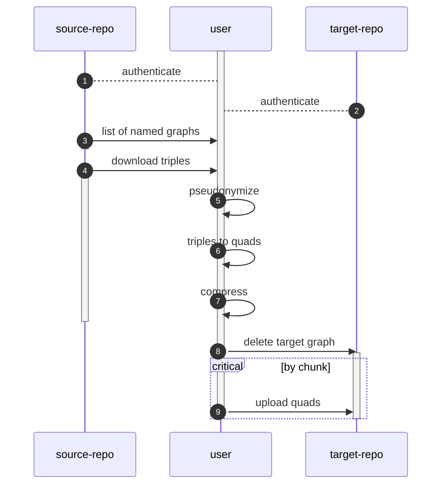
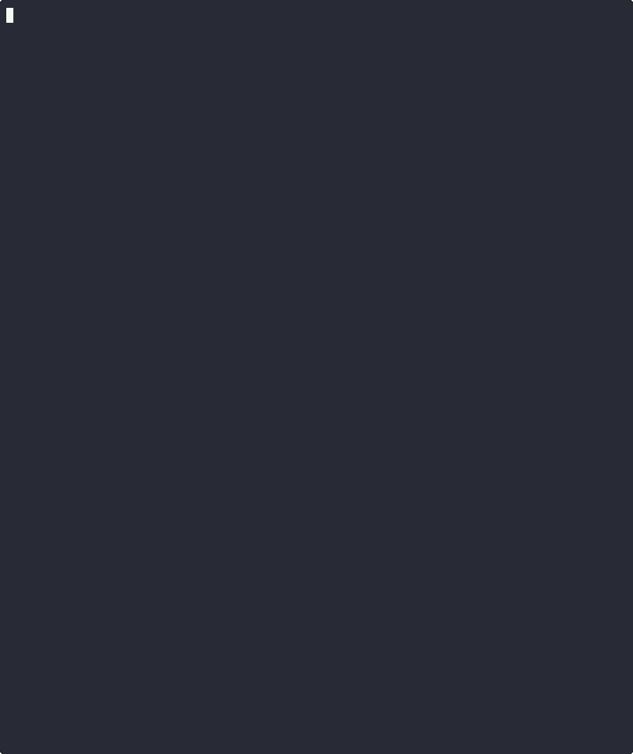

# Graphdb syncer

Automatically synchronize named graphs between GraphDB instances across B-spaces.

## Context

This operation can normally be achieved with a SPARQL INSERT query executed from the recipient database.

This tool is meant for situations with specific constraints. Namely:
* Firewall rules to not allow initiating connections from the recipient database (i.e. must _push_ data, not feasible with SPARQL)
* Data must be transferred over https using the GraphDB port.

## Process

1. Log in to source repo, generate token.
2. Log in to target repo, generate token.
3. Retrieve list of graphb URIs from source repo.
   + Exit if source graph uri is not found.
4. Download target graph from source repo.
5. Pseudonymize all URIs and identifiers in the graph.
   + This is done using [tripsu](https://github.com/sdsc-ordes/tripsu).
6. Attach target graph to triples, making them quads.
7. Compress in preparation to upload.
8. Delete graph from target repo.
9. Upload graph in chunks.



## Requirements

The script and all dependencies are containerized. The container can be built and run with docker or podman using the provider Containerfile. 

Credentials to access graphdb instances should be added to a .env file. A `.example.env` file is provided to show all variables available

## Usage

A [justfile](./justfile) (see [just](https://github.com/casey/just?tab=readme-ov-file#packages)) is provided to simplify usage. You can see a list of available actions by typing `just`.

### Using podman

To build the image and run the tool within a container using podman:

```sh
# This assumes there is a .env file in the working directory
$ just image-build
$ just container-run <source-graph-uri> <target-graph-uri>
```

### Without container

```sh
# dependencies must be installed on host (bash, curl, coreutils, tripsu)
$ just run <source-graph-uri> <target-graph-uri>
```

### Inside dev environment

To work interactively in the containerized environment:

```sh
# enter containerized environment
$ just container-dev
# Now all dependencies are available
$ just run ${SOURCE_GRAPH} ${TARGET_GRAPH} 
```

> [!NOTE]
> If just is not available on the host, you can run its command directly (after setting variables):
> ```sh
>$  podman run \
>    --rm \
>    -it \
>    --network=host \
>    -v "${TMPDIR}/syncer:/tmp/syncer" \
>    -v "${PWD}:/app" \
>    -e TMPDIR=/tmp/syncer \
>    -e QUERY_PATH=${QUERY_PATH} \
>    -e LOGDIR=${LOGDIR} \
>    --env-file .env \
>    ${IMAGE}:${TAG}
> ```

A log file with unique filename (inc. timestamp and PID) will be automatically created in the directory.

### Watching a folder

A helper recipe and script are provided to continuously watch for new source updates:

```sh
$ just container-dev
$ just watch /tmp/syncer/logs
```

In the example above, we enter the containerized environment, which mounts the host /tmp/syncer folder, and watch for filesystem events in that folder.
`just watch` is configured to trigger `scripts/watchexec-event.sh` whenever a json file is created or updated in the target folder.
The script `scripts/watchexec-event.sh` is written specifically to parse logs from [`graphdb-loader`](https://github.com/sdsc-ordes/nds-lucid-graphdb-loader), but can be adapted for specific use-cases.

The intended usage of graphdb-loader + graphdb-syncer is as follows:

```sh
# Continuously watch for new files to load into graphdb
$ git clone https://github.com/sdsc-ordes/nds-lucid-graphdb-loader && cd nds-lucid-graphdb-loader
$ nextflow run ./main.nf --log_dir /tmp/syncer/logs --watch
```

```sh
# Continuously watch for new data loaded into graphdb to sync
$ git clone https://github.com/sdsc-ordes/nds-lucid-graphdb-syncer && cd nds-lucid-graphdb-syncer
$ just container-dev
$ just watch /tmp/syncer/logs
```

> [!TIP]
> When running the tool directly, you can set additional variables on the command line, such as `TARGET_REPO`, just remove them from the `.env` file and prepend them to the command.
>
> For example: `TMPDIR=/data TARGET_REPO='custom-repo' ./bin/graphdb-sync <source-graph> <target-graph>` 

## Demo

